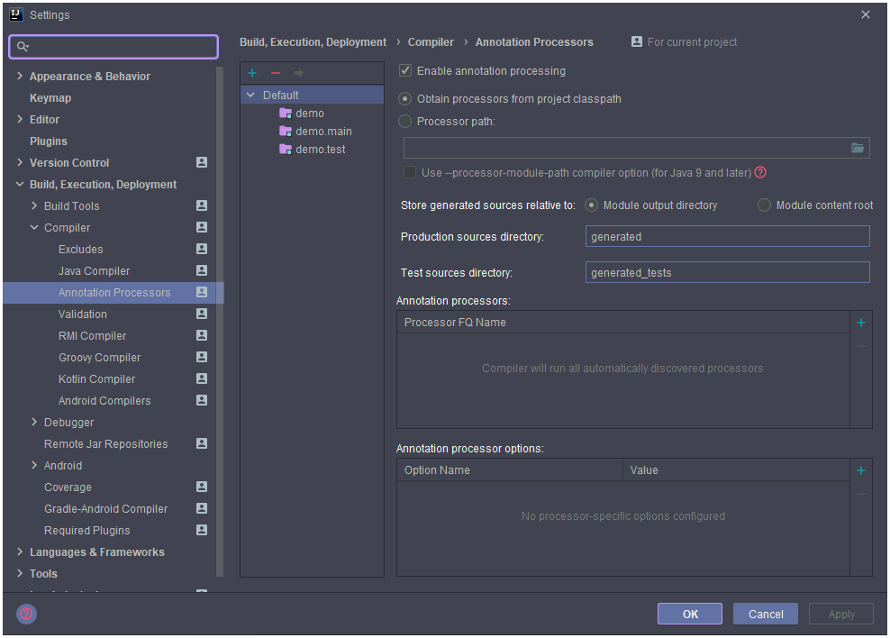

# Hướng dẫn sử dụng Lombok để code Java nhanh

## Giới thiệu

**Lombok** là một thư viện, một plugin, giúp chúng ta giảm thiểu các đoạn code thừa (boilerplate) bằng cách tự động sinh ra các hàm `Get`, `Set`, `Constructor`, v.v..

Chắc hẳn ai là `Java Developer` chinh chiến nhiều năm thì đều ngán ngẩm với việc ngồi viết những hàm `Get/Set`, Các `Constructor` có tham số lặp đi lặp lại, mặc dù các IDE đều hỗ trợ Generate tự động, tuy nhiên khi Project lớn, việc quản lý hàng chục function như vậy trông rất rối mắt và thừa thãi.

Từ đây, vị cứu tinh của chúng ta, **Lombok** ra đời
Với tiêu chí giúp developer tập trung vào tầng nghiệp vụ và logic thay vì mất thời gian làm những việc "thừa thãi". 
Không những làm cho code sáng sửa mà còn trông rất hợp lý, dễ quản lý hơn.
Sức mạnh của **Lombok** không chỉ dừng ở việc `Get/Set` mà còn nhiều khả năng tuyệt vời khác nữa.

## Cài đặt 

Cần cài `Lombok` trong project và trong IDE

1. Đưa `Lombok` vào project

*Maven*

```
<dependency>
    <groupId>org.projectlombok</groupId>
    <artifactId>lombok</artifactId>
    <version>1.18.4</version>
    <scope>provided</scope>
</dependency>
```

*Gradle*

```
// https://mvnrepository.com/artifact/org.projectlombok/lombok
providedCompile group: 'org.projectlombok', name: 'lombok', version: '1.18.12'
```

> click vào link để tải lombok mới nhất 

2. Cài `Lombok plugin` vào IDE

Nếu không có bước này thì project sẽ bị lỗi 

Sau khi cài `Lombok`, ta cấu hình 

`Restart IDE` > `File` > `Setting` > `Other Setting` > `Lombok Plugin` > `Enable Lombok plugin` for this project > `Apply`


`File` > `Setting` > `Build`, `Execution`, `Deployment` > `Complier` > `Annotation Processors` > `Apply`



Như vậy là xong

## Sử dụng Lombok

`Lombok` dùng `annotation` để khai báo với trình biên dịch.

### Annotation @Data

